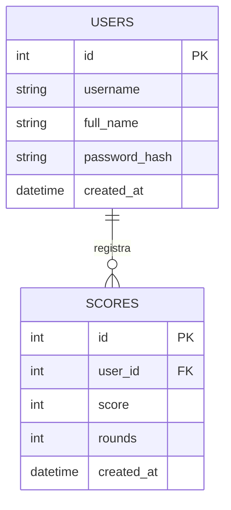

# Documentacion - Solar Score Arena

## 1. Navegacion
- Inicio de proyecto: `index.php`
- Redireccion a login: `front/login.php`
- Autenticacion: `back/auth_login.php`
- Dashboard principal: `front/dashboard.php`
- Cierre de sesion: `back/logout.php`
- API interna de juego: `api/game_data.php`
- API interna de insercion: `api/save_score.php`
- API interna de reportes: `api/report_data.php`

## 2. Tecnologia por utilizar
- HTML5 para estructura de vistas.
- CSS3 para diseno responsivo y experiencia visual.
- JavaScript para dinamica del juego y render de reportes.
- PHP para logica backend, autenticacion, consumo de API y endpoints.
- MySQL para persistencia de usuarios y puntajes (XAMPP / Workbench).

## 3. Reglas de negocio implementadas
- Solo usuarios precargados pueden ingresar.
- Una partida tiene 5 rondas por defecto.
- El puntaje se calcula por aciertos con bono por racha.
- Al finalizar la partida se guarda: usuario, puntaje, rondas, fecha.
- Todo evento importante se registra en log con ruta y nombre de evento.
- Los reportes permiten:
  - historial por usuario,
  - agregado semanal,
  - agregado mensual,
  - consolidado historico.

## 4. Experiencia de usuario (UX)
- Interfaz clara tipo dashboard con metricas en tiempo real.
- Flujo guiado: iniciar partida, responder, guardar, revisar reportes.
- Feedback inmediato para respuesta correcta/incorrecta.
- Layout responsive para escritorio y movil.
- Animaciones de entrada suaves y jerarquia visual por tarjetas.

## 5. Modelo Entidad-Relacion (ER)
Entidades:
- users
  - id (PK)
  - username (UNIQUE)
  - full_name
  - password_hash
  - created_at
- scores
  - id (PK)
  - user_id (FK -> users.id)
  - score
  - rounds
  - created_at

Relaciones:
- Un usuario tiene muchos puntajes (1:N).
- Cada puntaje pertenece a un usuario (N:1).

## 6. Logging de eventos
- Archivo: `logs/solar_events.log`
- Formato: JSON por linea.
- Campos base:
  - timestamp
  - route
  - event
  - user
  - context

## 7. Configuracion de log
En `back/config.php` se puede personalizar:
- Ruta: `LOG_DIR`
- Nombre de archivo: `LOG_FILE_NAME`

## 8. Configuracion de base de datos (MySQL)
En `back/config.php` se puede personalizar:
- `DB_HOST`
- `DB_PORT`
- `DB_NAME`
- `DB_USER`
- `DB_PASSWORD`

Adicionalmente, puede ejecutar `database/schema.sql` desde MySQL Workbench para crear el esquema manualmente.
